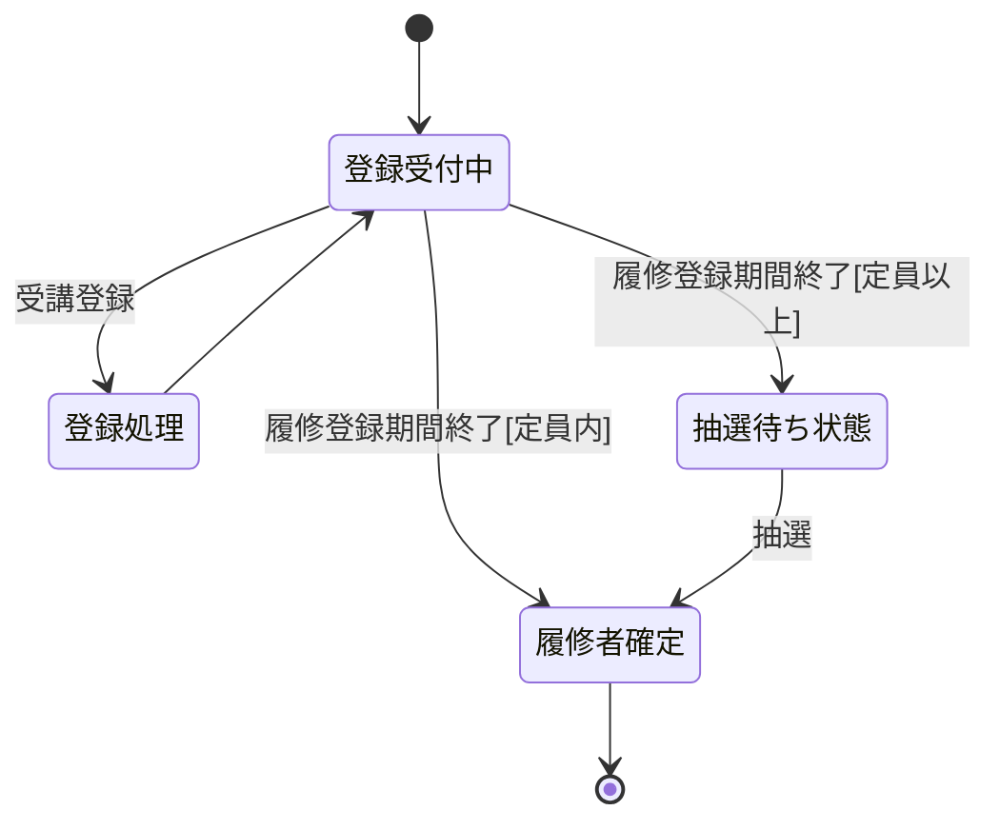

# 演習1

```mermaid
stateDiagram-v2
  direction TB
  s1 : 登録受付中
  s2 : 登録処理
  s3 : 履修者確定
  s4 : 抽選待ち状態

 [*] --> s1
  s1 --> s2 : 受講登録
  s2 --> s1 
  s1 --> s3 :履修登録期間終了[定員内]
  s1 --> s4 :履修登録期間終了[定員以上]
s4 --> s3 :抽選
s3 --> [*]

```
